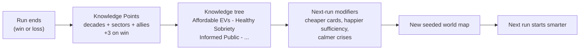

# High-Level System Diagram — The Drawdown Protocol

Two views: the run-time loop (everything inside one timeline) and the meta loop
(what persists between timelines). Simulation core stays headless and deterministic;
the UI only subscribes to it.

## Run Loop (one year = one turn)

```mermaid
flowchart TD
    GEN["Procedural world generation\n(seeded: starting emissions mix,\nsinks, money, happiness)"] --> RS

    subgraph RUN["One run: 2030 - 2100, one card per year"]
        RS["Run state\nMoney - Carbon - Happiness\nWarming T, Influence, Allies"]

        RS --> INC["1. Income phase\nMoney: 100 + 20/ally\nInfluence: 2 + 1/ally (+1 media)"]
        INC --> ACT["2. Player action: play ONE card"]

        ACT --> IND["Industry cards"]
        ACT --> TRA["Transport cards"]
        ACT --> AGR["Agro-economy cards"]
        ACT --> SNK["Sink restoration cards"]
        ACT --> DIP["Diplomacy cards\n(Form Alliance / Joint Project)"]
        ACT --> SOCC["Social cards\n(Media, Wellbeing, Adaptation)"]

        IND & TRA & AGR --> LEDGER["3. Carbon ledger\nE = sector bases x (1 - 0.9 x progress)\nA = sinks +/- restoration, stress, fires\nN = E - A"]
        SNK --> LEDGER
        DIP --> ALLY["Allies\nmore money + influence\nbigger joint projects"] --> INC
        SOCC --> HAP

        LEDGER --> WARM["4. Warming\nT += 0.001 x N (if N > 0)"]
        WARM --> HAP["5. Happiness drift\ntransition co-benefits\nminus Overshoot stress"]
        HAP --> EVT["6. Random events\nheat wave, mega fire,\nflood, social crisis"]
        EVT -->|damage x (1 - R/200)| RS
        EVT -->|"opportunity riders:\nrebuild better, policy window"| ACT
        WARM --> FB["7. Feedback loops (one-time)\npermafrost +2E at 1.75\nocean sink -2A at 1.90\nAmazon -3A after 3 fires"]
        FB --> LEDGER
        WARM --> CHK{"8. Check"}
        CHK -->|"T >= 2.0"| LOSS["LOSS: limit breached"]
        CHK -->|"year 2100, N <= 0"| WIN["WIN: carbon-neutral world"]
        CHK -->|"year 2100, N > 0"| SOFT["Soft loss: survived, not neutral"]
        CHK -->|otherwise| RS
    end
```

## Meta Loop (between runs)



## Coupling Notes

- **Happiness → Money:** income ×0.75 below 40 happiness, ×0.5 below 25 — the social death
  spiral is systemic, not an instant game over.
- **Happiness + Adaptation → Resilience (derived):** `R = 0.4·H + adapt`, capped 100;
  scales all event damage by `1 − R/200`.
- **Warming → everything:** past +1.5 °C (Overshoot) event probabilities rise, sinks degrade
  yearly, and happiness takes stress — the game's escalating tension comes from this single
  readable driver.
- **Diplomacy → scale:** allies are the only income multiplier; joint projects are the only
  card touching all three sectors at once. Being allied must always beat being alone
  (pillar: Influence, Not Authority).
