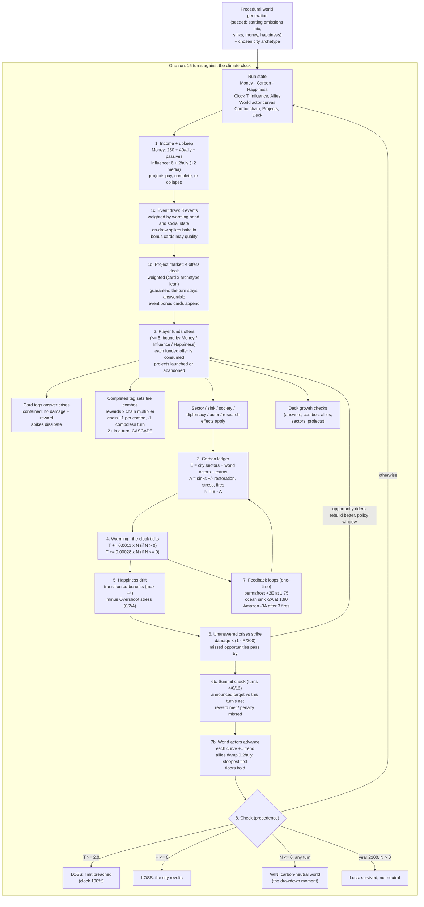
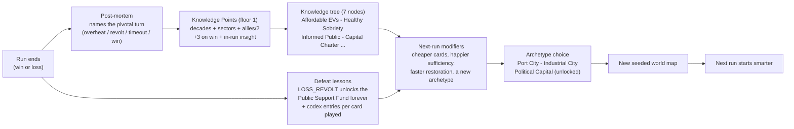

# High-Level System Diagram — The Drawdown Protocol

Two views: the run-time loop (everything inside one timeline) and the meta loop
(what persists between timelines). Simulation core stays headless and deterministic;
the UI only subscribes to it.

## Run Loop (one turn = five years; 15 turns, 2030–2100)

## Meta Loop (between runs)

## Coupling Notes

- **The clock → everything:** the world's blocs add ~+1.6 Gt/turn of drift, so net
  emissions — and the clock — worsen by default. Every system is ultimately a way to
  bend that one gauge; the HUD forecasts its next tick so the race is always legible.
- **Crises → everything:** the turn's draw is immediate pressure; answering costs tempo
  (money that could transform sectors or fund transitions abroad) but pays resources
  back; ignoring costs pillars, bakes heat-wave spikes into the ledger, and — for fires
  and droughts — eats the sink itself.
- **The market → texture:** each turn's 4 offers are a different hand; reading the deal
  (and knowing a crisis-answering offer is guaranteed) is the roguelike layer on top of
  the deterministic sim.
- **Combos → economy:** combo rewards (scaled by the chain) are the main way a
  well-built turn funds the next answer — the engine of the game's energy.
- **Projects → the long game:** three turns of upkeep is a promise made against future
  crisis turns; completion powers (income, sinks, wellbeing, allies) compound for the
  rest of the run.
- **Deck growth → options:** answered crises, combos, allies, sector progress and
  completed projects unlock new cards mid-run — and defeats unlock cards across runs.
- **Happiness → Money → the revolt line:** income ×0.75 below 40 happiness, ×0.5 below
  25; at 0 the city revolts and the run ends. The spiral is systemic long before it is
  terminal.
- **Happiness + Adaptation → Resilience (derived):** `R = 0.4·H + adapt`, capped 100;
  scales all unanswered-crisis damage by `1 − R/200`.
- **Warming → escalation:** past +1.5 °C (Overshoot) crisis draw weights rise, sinks
  degrade each turn, and happiness takes stress.
- **Diplomacy → scale:** allies are the only income multiplier AND the only damper on
  world drift; funded transitions abroad are the cheapest tons in the game. Being
  allied must always beat being alone (pillar: Influence, Not Authority).
- **Summits → tempo:** announced targets convert the long race into mid-run deadlines;
  meeting them pays the treasury, missing them costs Influence and Happiness.
