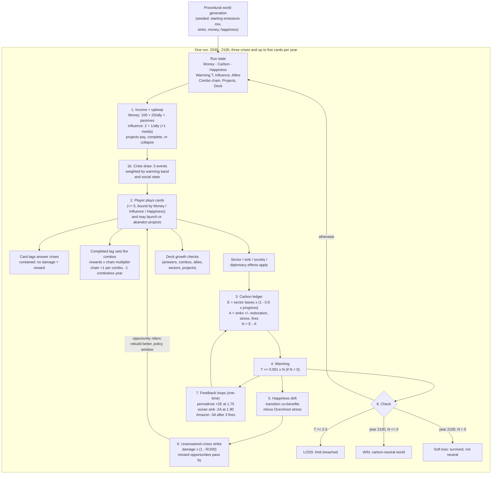
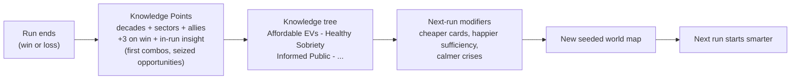

# High-Level System Diagram — The Drawdown Protocol

Two views: the run-time loop (everything inside one timeline) and the meta loop
(what persists between timelines). Simulation core stays headless and deterministic;
the UI only subscribes to it.

## Run Loop (one year = one turn)

## Meta Loop (between runs)

## Coupling Notes

- **Crises → everything:** the yearly draw is the turn's pressure; answering costs
  tempo (money that could transform sectors) but pays resources back; ignoring costs
  pillars and, for fires and droughts, the sink itself.
- **Combos → economy:** combo rewards (scaled by the chain) are the main way a
  well-built turn funds the next answer — the engine of the game's energy.
- **Projects → the long game:** upkeep is a promise made against future crisis years;
  completion powers (income, sinks, wellbeing, allies) compound for the rest of the run.
- **Deck growth → options:** answered crises, combos, allies, sector progress and
  completed projects unlock new cards mid-run — more diverse answers for harder years.
- **Happiness → Money:** income ×0.75 below 40 happiness, ×0.5 below 25 — the social death
  spiral is systemic, not an instant game over.
- **Happiness + Adaptation → Resilience (derived):** `R = 0.4·H + adapt`, capped 100;
  scales all unanswered-crisis damage by `1 − R/200`.
- **Warming → everything:** past +1.5 °C (Overshoot) crisis draw weights rise, sinks
  degrade yearly, and happiness takes stress — the game's escalating tension comes from
  this single readable driver.
- **Diplomacy → scale:** allies are the only income multiplier; joint projects are the
  only cards touching all three sectors at once. Being allied must always beat being
  alone (pillar: Influence, Not Authority).
